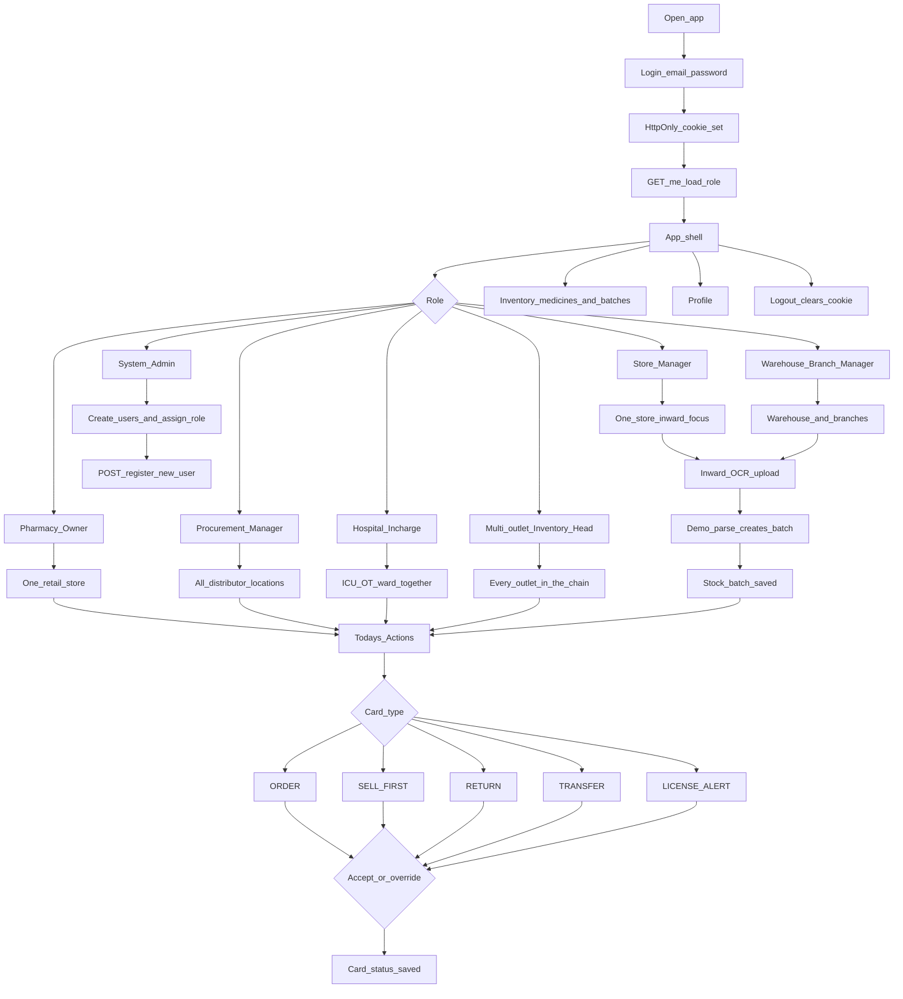

# PharmaStock AI

PharmaStock AI is an action-first inventory and compliance layer for Indian retail pharmacies, hospital pharmacies, distributors, and small chains. It is the Team Pilluminati entry for Smart India Hackathon 2026, problem statement SIH26179.

Pharmacies already sit on weeks of stock and still miss the prescribed brand. Near-expiry batches stay on the shelf, cold-chain items are not flagged at receiving, and a distributor can dispatch to a retailer whose drug license has lapsed. Existing billing software records yesterday's sale. It does not say what to do this morning.

PharmaStock AI sits on top of that data. Each day it connects batch, expiry, location, and demand into a short list of decisions: order, sell first, return, transfer, or renew a license. The person running the shop does not have to learn another ERP.

## What the product does

1. **Inward capture.** A supplier bill is uploaded and stored. The current build saves the file and returns a demo parse (batch, expiry, quantity, and a 2–8°C flag when the filename contains "cold"). A live Tesseract read is the next step behind the same API.
2. **Stock with context.** Medicines and batches are kept by organization and location, with expiry, quantity, velocity, and cold-chain tags.
3. **Today's actions.** Rules turn that stock into cards: reorder when cover is short, sell the nearer expiry first, flag a supplier return, flag a cold-chain move, and warn when the organization's drug license is missing, expired, or due within 60 days.
4. **A decision the user can defend.** Each card can be accepted or overridden. The status is stored so the recommendation is not a black box.
5. **Role-scoped access.** Seven login roles share one application. What changes is the organization, the locations they can see, and the job they came to do.

WhatsApp delivery, Prophet and LightGBM training, and the live Drug License Verification API are interfaces only. They are not called in this build.

## User flow

Every person signs in the same way. The role then decides which stock they see and which job they do next.



| Role | Scope | Primary step |
|---|---|---|
| Pharmacy Owner | One retail store | Accept or override order and sell-first cards |
| Store Manager | That same store | Upload a bill, then confirm the new batch |
| Procurement Manager | All distributor locations | Act on order quantity against expiry risk |
| Hospital In-charge | ICU, OT, and ward together | Act on cover, cold-chain, and sell-first |
| Warehouse / Branch Manager | Warehouse and branches | Receive stock, then transfer or sell first |
| Multi-outlet Inventory Head | Every outlet in the chain | Review chain-wide order, transfer, and expiry cards |
| System Admin | Platform | Create an account and attach one role, organization, and location |

License alerts are not uploaded. They appear when the organization's stored license date is missing, past, or inside 60 days. In the seeded data, only the retail store is inside that window.

## Stack

- **API:** Python, FastAPI, SQLAlchemy. PostgreSQL in deployment; SQLite for a local run.
- **Web app:** React, Vite, PWA, Tailwind CSS, Lucide icons, Framer Motion.
- **Session:** JWT stored only in an HttpOnly cookie. The browser never keeps the token in JavaScript.

## Run locally

### Database

PostgreSQL:

```bash
docker compose up -d
```

Or leave the local default, SQLite:

```text
DATABASE_URL=sqlite:///./pharmastock.db
```

### API

```bash
cd backend
python -m venv .venv
.venv\Scripts\activate
pip install -r requirements.txt
copy .env.example .env
python -m app.seed
uvicorn app.main:app --reload --port 8000
```

### Web app

```bash
cd frontend
npm install
npm run dev
```

Open http://localhost:5173. The dev server proxies `/api` to port 8000 so the login cookie stays on the same site.

### Seeded accounts

| Email | Password | Role |
|---|---|---|
| admin@pharmastock.example | ChangeMeAdmin123! | System Admin |
| owner@retail.example | Password123! | Pharmacy Owner |
| manager@retail.example | Password123! | Store Manager |
| procurement@dist.example | Password123! | Procurement Manager |
| hospital@hosp.example | Password123! | Hospital In-charge |
| warehouse@dist.example | Password123! | Warehouse / Branch Manager |
| chainhead@chain.example | Password123! | Multi-outlet Inventory Head |

For a cold-chain OCR demo, sign in as the store manager and upload any file named `cold-invoice.txt`. The parser returns Amoxicillin 500mg, quantity 120, and storage 2–8°C.

## Layout

```text
backend/    API, services, repositories, models
frontend/   React PWA
```

Routes call services. Services own the rules. Repositories own the database. The interface does not contain stock logic.
